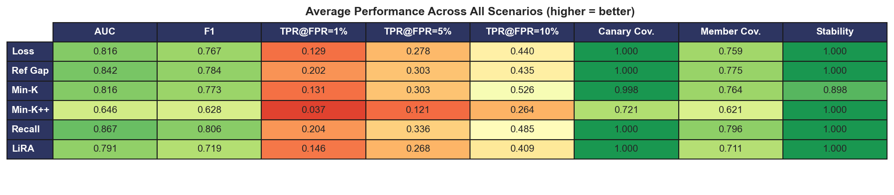
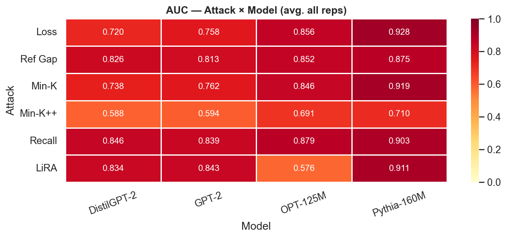
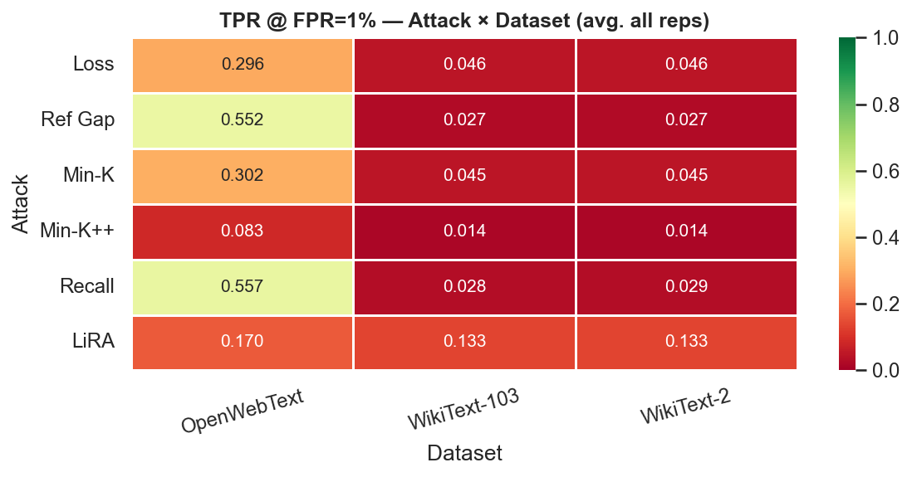
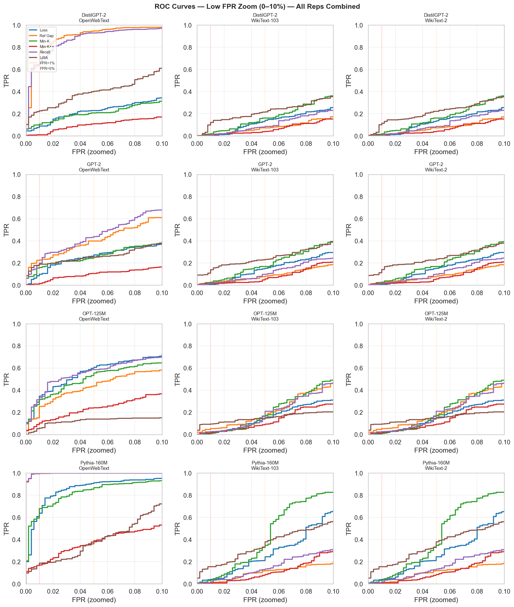
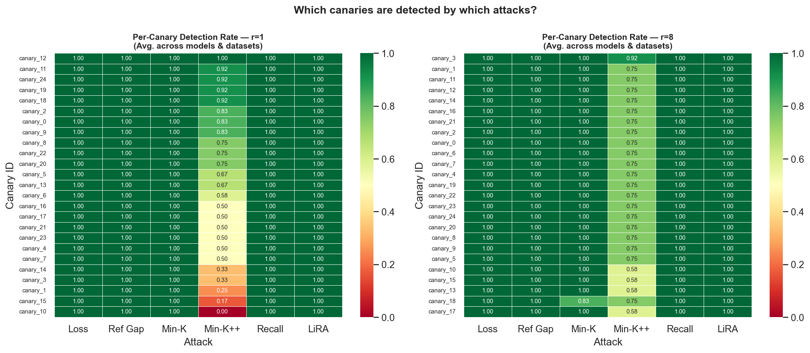
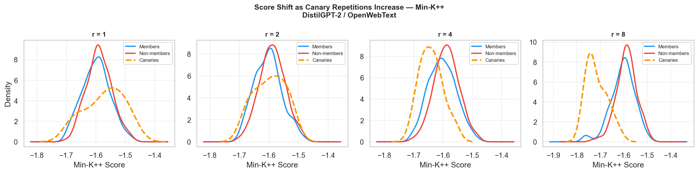
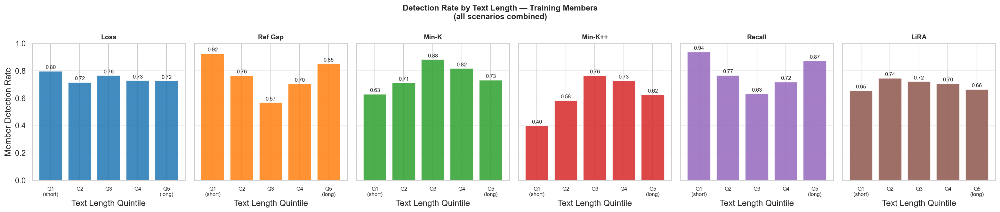
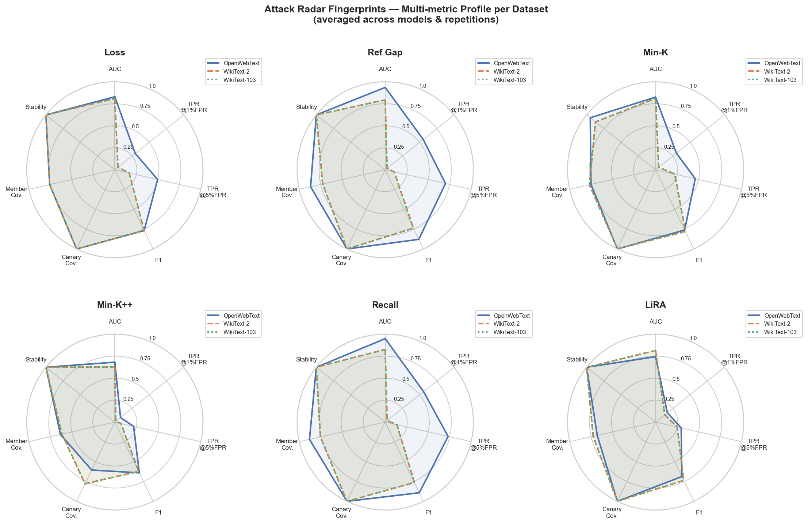

# Beyond AUC: Evaluating Coverage and Stability of Membership Inference Attacks in Large Language Models

## Authors

- **Ana Caroline Silva Pontara** — Universidade Estadual Paulista (UNESP), Brazil
- **Daniel Pederzini** — Pontifícia Universidade Católica de Minas Gerais (PUC Minas), Brazil

## Overview

This repository contains the code and experimental outputs for the paper *"Beyond AUC: Evaluating Coverage and Stability of Membership Inference Attacks in Large Language Models"*.

We propose a **multi-attack auditing protocol** that evaluates privacy leakage in Large Language Models (LLMs) beyond traditional aggregate metrics (AUC, precision, recall, F1). The protocol introduces two complementary evaluation dimensions:

- **Coverage**: the fraction of true training members detected by individual attacks and their union, including canary-specific coverage.
- **Stability**: the consistency of attack predictions across independent runs, measured by pairwise Jaccard similarity.

Experiments are run across **4 models**, **3 datasets**, and **4 canary repetition levels** (r = 1, 2, 4, 8), yielding 48 scenarios per attack.

## Attack Strategies

We implement and evaluate six membership inference attacks:

| Attack | Signal | Direction | Deterministic? |
|---|---|---|---|
| **Loss** | Cross-entropy loss of the fine-tuned model | lower → member | Yes |
| **Ref Gap** | Loss difference between fine-tuned and reference (pre-trained) model | lower → member | Yes |
| **Min-K%** | Average log-probability of the k% least-likely tokens | lower → member | No |
| **Min-K++** | Normalised variant of Min-K% using z-score over token distribution | lower → member | Yes |
| **Recall** | Fraction of tokens where fine-tuned model assigns higher probability than reference | lower → member | Yes |
| **LiRA** | Z-score of target loss relative to a distribution of shadow model losses | higher → member | Yes |

## Models & Datasets

| Models | Datasets |
|---|---|
| DistilGPT-2 | OpenWebText |
| GPT-2 | WikiText-2 |
| OPT-125M (facebook/opt-125m) | WikiText-103 |
| Pythia-160M (EleutherAI/pythia-160m) | |

## Key Results



- **Recall** achieves the best overall AUC (0.867) and member coverage (0.796), with perfect canary coverage and stability
- **Ref Gap** offers the strongest TPR at very low FPR (TPR@1%FPR = 0.202), making it the most practical attack in adversarial auditing settings
- **Min-K++** is the weakest attack on average (AUC = 0.646), but is fully deterministic; its signal depends strongly on domain
- **AUC alone is misleading** — attacks with similar AUC can detect entirely different subsets of members
- **Canary coverage ≠ member coverage** — all attacks except Min-K++ achieve near-perfect canary detection, but member coverage ranges from 0.62 to 0.80

## Results

### AUC by Attack × Model



Pythia-160M is the most vulnerable model across all attacks. LiRA shows unusually low AUC on OPT-125M (0.576) — see [Known Limitation](#known-limitation-lira-on-opt-125m--openwebtext) below.

### TPR @ 1% FPR by Attack × Dataset



OpenWebText consistently yields much higher TPR at low FPR than either WikiText variant. WikiText-2 and WikiText-103 are nearly indistinguishable in difficulty.

### ROC Curves — Low FPR Region



The zoomed view highlights the practical operating region for privacy audits. Recall and Ref Gap separate from Loss at low FPR across most scenarios.

### Canary Detection Rate



Loss, Ref Gap, Min-K, Recall, and LiRA all achieve perfect (1.0) canary detection across all 25 canaries. Min-K++ is the only attack that misses canaries, particularly at r=1.

### Score Shift with Canary Repetitions



As canaries are repeated more (r=1 → r=8), their score distribution shifts distinctly away from regular members and non-members, confirming that repetition-induced memorisation is the primary signal exploited by score-based attacks.

### Detection Rate by Text Length



Ref Gap and Recall strongly favour **short texts** (Q1), while Min-K peaks at medium lengths (Q3). Loss is relatively flat across quintiles. Min-K++ shows the strongest length bias of any attack.

### Multi-metric Radar Fingerprints



Each radar chart shows the full performance profile of one attack across the three datasets. OpenWebText (blue) consistently dominates on most axes. The LiRA fingerprint shows a notable TPR@1%FPR collapse on the WikiText variants.

## Known Limitation: LiRA on OPT-125M + OpenWebText

LiRA achieves **AUC = 0.32** (below random) for OPT-125M fine-tuned on OpenWebText. This is a principled failure of shadow-model calibration:

1. OPT-125M was pre-trained on web-crawl data (The Pile), which substantially overlaps with OpenWebText. The model's loss on these texts is already very low before fine-tuning.
2. Shadow models are trained for fewer epochs on a 50% subset of training data, so the target model has seen more of this domain overall.
3. As a result, the target loss is lower than the shadow model mean for **all** texts — not due to memorisation, but due to the extra fine-tuning. Common web-domain non-members receive unexpectedly high z-scores, inverting the ranking.

This does not occur on WikiText (an encyclopedic, out-of-domain corpus), where the shadow-model calibration assumption holds.

## Project Structure

```
.
├── config/
│   └── default_config.json      # Pipeline configuration
├── src/
│   ├── data.py                  # Dataset loading, canary generation, candidate sampling
│   ├── train.py                 # Model fine-tuning via HuggingFace Trainer
│   ├── attacks.py               # All six attack implementations (batched GPU inference)
│   ├── metrics.py               # Classification metrics, coverage, stability
│   ├── analysis.py              # Sample-level feature extraction
│   ├── plots.py                 # Plot generation helpers
│   ├── run_pipeline.py          # End-to-end pipeline orchestration
│   └── results.ipynb            # Full analysis notebook (50 cells, 40 figures)
├── output/
│   ├── figures/                 # Auto-saved figures (fig_01.png … fig_40.png)
│   └── <model>_<dataset>_r<n>/  # Per-scenario results (48 folders)
│       ├── attack_scores.csv
│       ├── metrics_summary.json
│       ├── sample_analysis.csv
│       └── run_config.json
└── requirements.txt
```

## Setup

### Requirements

- Python 3.10+
- Dependencies listed in `requirements.txt`

### Installation

```bash
pip install -r requirements.txt
```

### Running the Pipeline

```bash
python src/run_pipeline.py --config config/default_config.json
```

## Configuration

All parameters are controlled via `config/default_config.json`:

| Parameter | Default | Description |
|---|---|---|
| `models` | `["distilgpt2", "gpt2", "EleutherAI/pythia-160m", "facebook/opt-125m"]` | Models to evaluate |
| `max_train_texts` | `4000` | Training texts sampled per scenario |
| `max_eval_texts` | `800` | Evaluation texts per scenario |
| `max_length` | `128` | Maximum token sequence length |
| `num_train_epochs` | `2` | Fine-tuning epochs (shadow models use half) |
| `num_canaries` | `25` | Canary sequences inserted |
| `canary_repetitions` | `[1, 2, 4, 8]` | Repetition levels per canary |
| `member_sample_size` | `500` | Members sampled for attack evaluation |
| `nonmember_sample_size` | `500` | Non-members sampled for attack evaluation |
| `num_attack_runs` | `5` | Independent runs per attack |
| `num_shadow_models` | `4` | Shadow models trained for LiRA |
| `attacks` | `["loss","ref_gap","min_k","min_k_pp","recall","lira"]` | Active attack strategies |
| `min_k_ratio` | `0.2` | Fraction of tokens used by Min-K%/Min-K++ |
| `neighborhood_variants` | `3` | Perturbation variants for Min-K% |

## Key Takeaways

1. **AUC is not enough** — Two attacks with similar AUC can have very different precision–recall profiles, TPR @ low FPR, and threshold sensitivity.
2. **Score distributions reveal the mechanism** — Ref Gap and Recall create clear bimodal separation; simple Loss has substantial overlap.
3. **Canaries ≠ regular members** — High canary coverage does not imply high general member coverage.
4. **More repetitions help some attacks more than others** — The rate of improvement from r=1 to r=8 varies dramatically by attack type and dataset.
5. **Datasets matter as much as models** — Certain dataset/attack combinations consistently fail regardless of model size.
6. **Sample vulnerability is predictable** — Text length, token rarity, and the target–reference loss gap are measurable predictors of MIA detectability.
7. **Threshold choice is non-trivial** — The F1 gap between median and optimal thresholds reveals how much headroom some attacks have when tuned correctly.
8. **Pre-training domain affinity breaks LiRA's calibration** — LiRA performs below random on OPT-125M + OpenWebText due to shadow-model z-score inversion when pre-training and fine-tuning distributions overlap.

## License

This project is released for academic and research purposes.